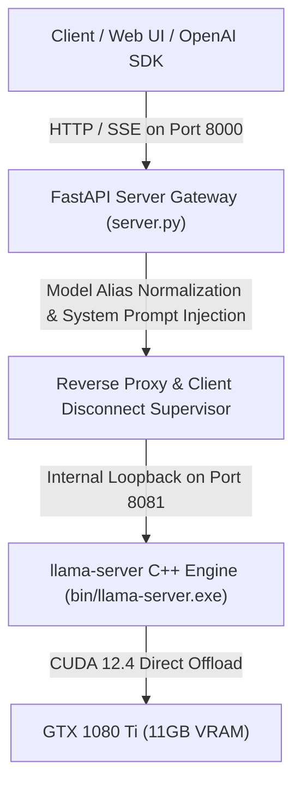

# Dual-Layer Gateway Architecture

## 1. Process Supervision (`engine_manager.py`)
- The Python gateway initializes `bin/llama-server.exe` as a supervised child process on loopback port `8081`.
- A blocking healthcheck polls `http://127.0.0.1:8081/health` until the model is 100% loaded into GPU VRAM before binding the public gateway on port `8000`.
- Graceful shutdown handles `SIGTERM` and `SIGKILL` on exit via Python `atexit` hooks.

## 2. Abort & Client Disconnect Handling
- When a user aborts via `AbortController` in the Web UI or closes an HTTP client connection, FastAPI's `request.is_disconnected()` triggers an immediate disconnect on the upstream socket to `llama-server.exe`.
- Token generation on the GPU halts immediately, preventing wasted compute cycles.
